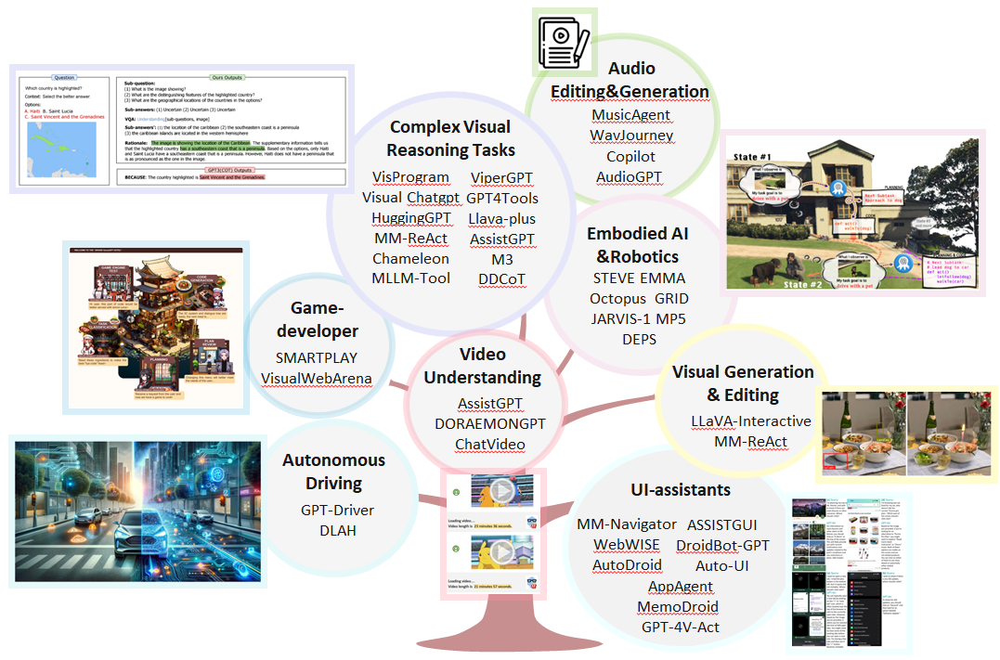

# Awesome-Multimodal-agents

<b> Table of Contents </b> 

- [Awesome Benchmark](#awesome-benchmark)
- [Awesome Papers](#Awesome-papers)
  - [Complex Visual Reasoning Tasks](#-complex-visual-reasoning-tasks)
  - [Audio Editing & Generation](#-audio-editing--generation)
  - [Embodied AI & Robotics](#-embodied-ai--robotics)
  - [UI-assistants](#--ui-assistants)
  - [Video Understanding](#-video-understanding)
  - [Visual Generation & Editing](#-visual-generation--editing)
  - [Game-developer](#-game-developer)
 
---

# Awesome Benchmark

- [**SmartPlay**](https://arxiv.org/pdf/2310.01557.pdf) - SmartPlay: A Benchmark for LLMs as Intelligent Agents [Github](https://github.com/microsoft/SmartPlay)

- [**VisualWebArena**](https://arxiv.org/pdf/2401.13649.pdf) - VisualWebArena: Evaluating Multimodal Agents on Realistic Visual Web Tasks [Github](https://github.com/web-arena-x/visualwebarena)

- [**GAIA**](https://arxiv.org/pdf/2311.12983.pdf) - GAIA: a benchmark for General AI Assistants [Github](https://huggingface.co/gaia-benchmark)

# Awesome Papers
### Application
### 💡 Complex Visual Reasoning Tasks

- [**ViperGPT**](https://arxiv.org/pdf/2303.08128.pdf) - ViperGPT: Visual Inference via Python Execution for Reasoning [Github](https://github.com/cvlab-columbia/viper)

- [**HuggingGPT**](https://arxiv.org/pdf/2303.17580.pdf) - HuggingGPT: Solving AI Tasks with ChatGPT and its Friends in Hugging Face [Github](https://github.com/microsoft/JARVIS)

- [**Chameleon**](https://arxiv.org/pdf/2304.09842.pdf) - Chameleon: Plug-and-Play Compositional Reasoning with Large Language Models [Github](https://github.com/lupantech/chameleon-llm)

- [**Visual ChatGPT**](https://arxiv.org/pdf/2303.04671.pdf) - Visual ChatGPT: Talking, Drawing and Editing with Visual Foundation Models [Github](https://github.com/moymix/TaskMatrix)

- [**AssistGPT**](https://arxiv.org/pdf/2306.08640.pdf) - AssistGPT: A General Multi-modal Assistant that can Plan, Execute, Inspect, and Learn [Github](https://github.com/showlab/assistgpt)

- [**LLaVA-Plus**](https://arxiv.org/pdf/2306.08640.pdf) - LLaVA-Plus: Large Language and Vision Assistants that Plug and Learn to Use Skills [Github](https://github.com/LLaVA-VL/LLaVA-Plus-Codebase)

- [**GPT4Tools**](https://arxiv.org/pdf/2305.18752.pdf) - GPT4Tools: Teaching Large Language Model to Use Tools via Self-instruction [Github](https://github.com/AILab-CVC/GPT4Tools)

- [**MLLM-Tool**](https://arxiv.org/pdf/2401.10727.pdf) - MLLM-Tool: A Multimodal Large Language Model For Tool Agent Learning [Github](https://github.com/MLLM-Tool/MLLM-Tool)

- [**M3**](https://arxiv.org/pdf/2310.08446.pdf) - Towards Robust Multi-Modal Reasoning via Model Selection [Github](https://github.com/LINs-lab/M3)

- [**VisProgram**](https://arxiv.org/pdf/2211.11559.pdf) - Visual Programming: Compositional visual reasoning without training

- [**DDCoT**](https://arxiv.org/pdf/2310.16436.pdf) - DDCoT: Duty-Distinct Chain-of-Thought Prompting for Multimodal Reasoning in Language Models [Github](https://github.com/SooLab/DDCOT)

### 🎵 Audio Editing & Generation

- [**Copilot**](https://arxiv.org/pdf/2310.12404.pdf) - Loop Copilot: Conducting AI Ensembles for Music
Generation and Iterative Editing [Github](https://github.com/ldzhangyx/loop-copilot/)

- [**MusicAgent**](https://arxiv.org/pdf/2310.11954.pdf) - MusicAgent: An AI Agent for Music Understanding and Generation with Large Language Models [Github](https://github.com/microsoft/muzic/tree/main)

- [**WavJourney**](https://arxiv.org/pdf/2310.12404.pdf) - WavJourney: Compositional Audio Creation with Large Language Models [Github](https://github.com/Audio-AGI/WavJourney)

- [**AudioGPT**](https://arxiv.org/pdf/2304.12995.pdf) - AudioGPT: Understanding and Generating Speech,
Music, Sound, and Talking Head [Github](https://github.com/AIGC-Audio/AudioGPT)

### 🤖 Embodied AI & Robotics

- [**JARV IS-1**](https://arxiv.org/pdf/2311.05997.pdf) - JARVIS-1: Open-world Multi-task Agents with
Memory-Augmented Multimodal Language Models [Github](https://github.com/CraftJarvis/JARVIS-1)

- [**DEPS**](https://arxiv.org/pdf/2302.01560.pdf) - Describe, Explain, Plan and Select:
Interactive Planning with Large Language Models Enables Open-World Multi-Task Agents [Github](https://github.com/CraftJarvis/MC-Planner)

- [**Octopus**](https://arxiv.org/pdf/2310.08588.pdf) - Octopus: Embodied Vision-Language Programmer from Environmental Feedback [Github](https://github.com/dongyh20/Octopus)

- [**GRID**](https://arxiv.org/pdf/2311.05997.pdf) - GRID: A Platform for General Robot Intelligence Development [Github](https://github.com/ScaledFoundations/GRID-playground)

- [**MP5**](https://arxiv.org/pdf/2312.07472.pdf) - MP5: A Multi-modal Open-ended Embodied System in Minecraft via Active Perception [Github](https://github.com/IranQin/MP5)

- [**STEVE**](https://arxiv.org/pdf/2311.15209.pdf) - See and Think: Embodied Agent in Virtual Environment [Github](https://github.com/rese1f/STEVE)

- [**EMMA**](https://arxiv.org/pdf/2311.16714.pdf) - Embodied Multi-Modal Agent trained by an LLM from a Parallel TextWorld [Github](https://github.com/stevenyangyj/Emma-Alfworld)

### 🖱️💻 UI-assistants
- [**AppAgent**](https://arxiv.org/pdf/2312.13771.pdf) - AppAgent: Multimodal Agents as Smartphone Users [Github](https://github.com/mnotgod96/AppAgent)

- [**DroidBot-GPT**](https://arxiv.org/pdf/2304.07061.pdf) - DroidBot-GPT: GPT-powered UI Automation for Android [Github](https://github.com/MobileLLM/DroidBot-GPT)

- [**WebWISE**](https://arxiv.org/pdf/2310.16042.pdf) - WebWISE: Web Interface Control and Sequential Exploration with Large Language Models [Github](https://github.com/stevenyangyj/Emma-Alfworld)

- [**MemoDroid**](https://arxiv.org/pdf/2312.03003.pdf) - Explore, Select, Derive, and Recall: Augmenting LLM with Human-like Memory for Mobile Task Automation 

- [**ASSISTGUI**](https://arxiv.org/pdf/2312.13108.pdf) - ASSISTGUI: Task-Oriented Desktop Graphical User Interface Automation [Github](https://github.com/showlab/assistgui)

- [**MM-Navigator**](https://arxiv.org/pdf/2311.07562.pdf) - GPT-4V in Wonderland: Large Multimodal Models for Zero-Shot Smartphone GUI Navigation [Github](https://github.com/zzxslp/MM-Navigator)

- [**AutoDroid**](https://arxiv.org/pdf/2308.15272.pdf) - Empowering LLM to use Smartphone for Intelligent Task Automation [Github](https://github.com/MobileLLM/AutoDroid)

- [**GPT-4V-Act**](https://github.com/ddupont808/GPT-4V-Act) - GPT-4V-Act: Chromium Copilot [Github](https://github.com/ddupont808/GPT-4V-Act)

- [**Auto-UI**](https://arxiv.org/pdf/2309.11436.pdf) - You Only Look at Screens: Multimodal Chain-of-Action Agents [Github](https://github.com/cooelf/Auto-UI)

### 🎨 Visual Generation & Editing
- [**LLaVA-Interactive**](https://arxiv.org/pdf/2311.00571.pdf) - 
LLaVA-Interactive: An All-in-One Demo for Image Chat, Segmentation, Generation and Editing [Github](https://github.com/LLaVA-VL/LLaVA-Interactive-Demo)

- [**MM-REACT**](https://arxiv.org/pdf/2303.11381.pdf) - MM-REACT: Prompting ChatGPT for Multimodal Reasoning and Action [Github](https://github.com/microsoft/MM-REACT)

### 🎥 Video Understanding

- [**DoraemonGPT**](https://arxiv.org/pdf/2401.08392.pdf) - DoraemonGPT: Toward Understanding Dynamic Scenes with Large Language Models [Github](https://github.com/cooelf/Auto-UI)

- [**ChatVideo**](https://arxiv.org/pdf/2304.14407.pdf) - ChatVideo: A Tracklet-centric Multimodal and Versatile Video Understanding System [Github](https://www.wangjunke.info/ChatVideo/)

- [**AssistGPT**](https://arxiv.org/pdf/2401.08392.pdf) - AssistGPT: A General Multi-modal Assistant that can Plan, Execute, Inspect, and Learn [Github](https://github.com/showlab/assistgpt)

### 🚗 Autonomous Driving

- [**GPT-Driver**](https://arxiv.org/pdf/2310.01415.pdf) - GPT-Driver: Learning to Drive with GPT [Github](https://github.com/PointsCoder/GPT-Driver)

- [**DLAH**](https://arxiv.org/pdf/2307.07162.pdf) - Drive Like a Human: Rethinking Autonomous Driving with Large Language Models [Github](https://github.com/PJLab-ADG/DriveLikeAHuman)

### 🎮 Game-developer

- [**SmartPlay**](https://arxiv.org/pdf/2310.01557.pdf) - SmartPlay: A Benchmark for LLMs as Intelligent Agents [Github](https://github.com/microsoft/SmartPlay)

- [**VisualWebArena**](https://arxiv.org/pdf/2401.13649.pdf) - VisualWebArena: Evaluating Multimodal Agents on Realistic Visual Web Tasks [Github](https://github.com/web-arena-x/visualwebarena)

